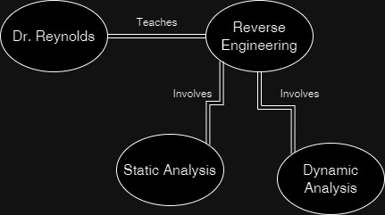

# Reverse Engineering Final Assignment

### This assignment is a take-home final

### Due by 5/9 @ 11:59PM

This exam activity is designed to support long-term memory formation to help you retain the key concepts of this course. It is also designed to be difficult for current AI to help with, allowing for a take-home exam. Please work alone -- I don't want to see identical submissions.

## Organize the concepts you learned this semester

### Requirements
Create a concept map from the following list of terms from this course.

This concept map must be digitally generated, and be turned in in .PDF format. It will likely make sense to create a poster-sized PDF rather than trying to cram everything onto a sheet of letter-paper.

Every concept must be used in only one place. The concept map must be strongly connected in the graph theory sense.

The concept map will consist of nodes from the list below, and edges that you will create. Each edge should have a 1-3 word description of the nature of the connection.

Example:

### Suggestions

Managing all these connections. I suggest using a flow-charting tool like:
- Microsoft Visio
- Lucidchart
- Omnigraffle
- Draw.io
- DIA
- SmartDraw

You may find it useful to print these terms onto cards to arrange them. 

You can also benefit from the organization work done both by the textbook and the lecture slides.

### Rubric

A concept map that includes all the terms, and is non-randomly organized will earn at least a passing score.

A concept map where most of the concepts are connected to others by only one line is likely incompletely thought out.

A concept map that is a mess of connections is likewise incompletely thought out. (i.e. don't draw a line from every concept to every other concept, nor from "Reverse Engineering" to everything else :) 

I recommend an average degree of ~3 for each node, and make the effort to have relatively few connection-line crossovers. A few nodes will have many connections, and others only one or two.

## List of Terms to Concept-Map

- Thread
- Format String Vulnerability
- Yara Rules
- Process
- CPU
- Wireshark
- RBP
- Use-After-Free
- Virtual Machine
- Procmon
- pwntools
- Fakenet
- OSINT
- Sink
- .EXE
- file handles
- Registers
- ARM
- Sandbox
- Return Instruction
- Botnet
- Breakpoint
- Malware
- DLLMain()
- Cryptor
- Assembly
- RIP
- NJRat
- Dropper
- GDB
- User Space
- Regshot
- NSA
- Process Injection
- Virus
- \<YOUR NAME HERE\>
- Debug
- Segmentation Fault
- Network Isolation
- CreateRemoteThread()
- Virtual Address Spaces
- x86
- Compiler
- Symmetric Encryption
- Kernel Mode Driver
- LoadLibraryA()
- Machine Code
- VirusTotal
- Rootkit
- Ransomware
- DEP
- Volatility
- x64dbg
- C2
- Base64 Encoding
- Memory Forensics
- Control Flow Graph
- Windows Registry
- Control Flow Integrity
- OpSec
- Asymmetric Encryption
- Snapshot
- ASLR
- 32bit
- Source
- RSP
- Control Flow
- Pool Tag Scanning
- Dynamic Analysis
- Crackme
- Keylogger
- Device I/O
- PEExplorer
- VAD
- Control Flow Hijacking
- Worm
- Obfuscation
- C Calling Conventions
- Windows Defender
- Persistence
- Buffer Overflow
- Ghidra
- .SO
- 64bit
- Decompiler
- Shellcode
- .DLL
- Loader
- sockets
- RAM
- Syscall Calling Conventions
- Reverse Engineering
- PEB
- ROP
- _EPROCESS
- FLOSS
- Kernel Space
- Hypervisor
- Static Analysis
- IDA
- NoOp Sled
- "MZ"
- Stack Canaries
- Packer
- Indicators of Compromise
- Scylla
- WinDBG
- PatchGuard
- Strings
- DKOM
- RAT
- Disassembly
- Stack Frames
- RCE
- Hashes

## Identify the 3 most intellectually interesting things you learned in this course. Why did you choose these 3?

Place these on the PDF you are turning in.

1.

2.

3.

## Identify the 3 most professionally useful things you learned in this course. Why did you choose these 3?

Place these on the PDF you are turning in.

1.

2.

3.

### You are encouraged to fill out the anonymous course feedback form on Canvas. 

#### Have a wonderful summer break!

-Dr. Reynolds